# Hướng dẫn sử dụng CLI

MyVPS CLI là công cụ dòng lệnh quản lý VPS, gồm 20+ modules.

## Cách dùng

```bash
myvps                       # Menu tương tác
myvps [module]              # Vào menu module
myvps [module] [action]     # Chạy action trực tiếp
myvps --json [module]       # Output JSON (cho API)
myvps help                  # Trợ giúp
myvps version               # Phiên bản
```

## Main Menu

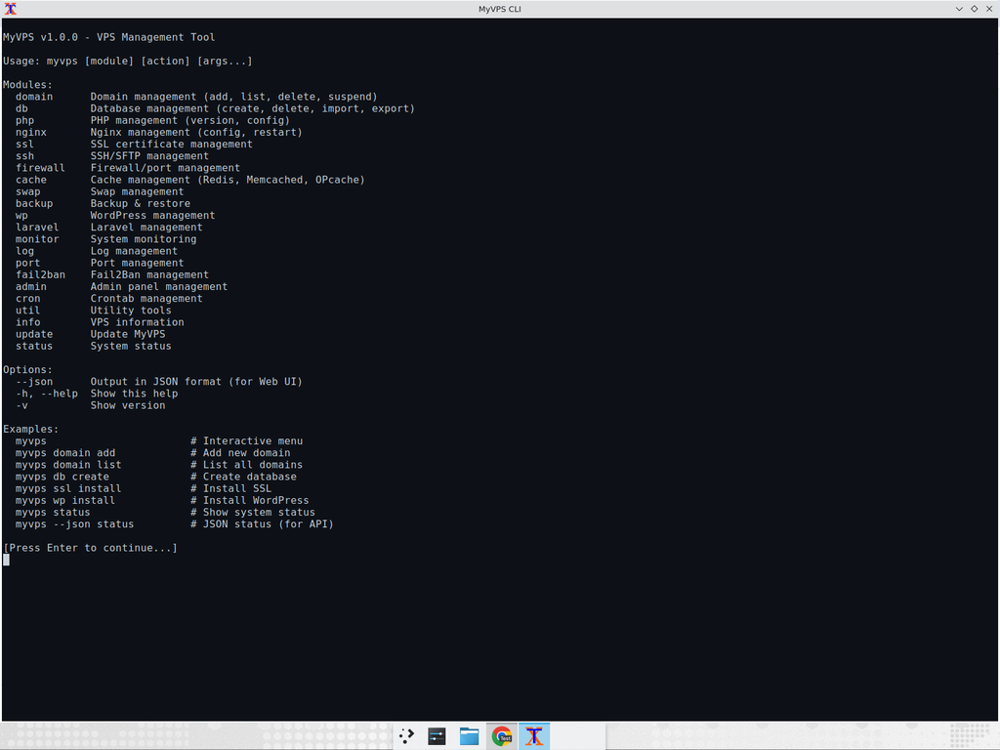

---

## Module 1: Domain Management

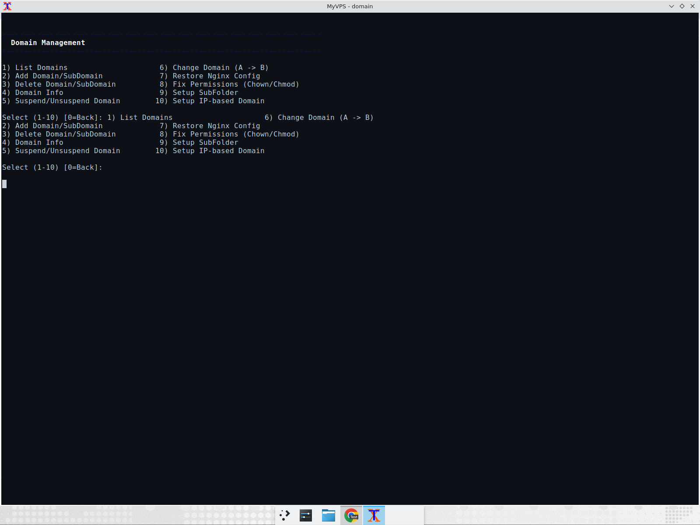

```bash
myvps domain                # Menu quản lý domain
myvps domain list           # Liệt kê domain
myvps domain add            # Thêm domain
myvps domain delete         # Xóa domain
myvps domain info           # Thông tin domain
myvps domain suspend        # Tạm dừng domain
```

| # | Chức năng | Mô tả |
|---|-----------|-------|
| 1 | List Domains | Liệt kê tất cả domain |
| 2 | Add Domain/SubDomain | Thêm domain mới, tạo user, nginx config, PHP-FPM pool |
| 3 | Delete Domain/SubDomain | Xóa domain, user, nginx config |
| 4 | Domain Info | Thông tin chi tiết domain |
| 5 | Suspend/Unsuspend | Tạm dừng/kích hoạt domain |
| 6 | Change Domain | Đổi tên domain (A → B) |
| 7 | Restore Nginx Config | Khôi phục config nginx |
| 8 | Fix Permissions | Sửa quyền file (chown/chmod) |
| 9 | Setup SubFolder | Cấu hình subfolder |
| 10 | Setup IP-based Domain | Domain theo IP |

---

## Module 2: Database Management

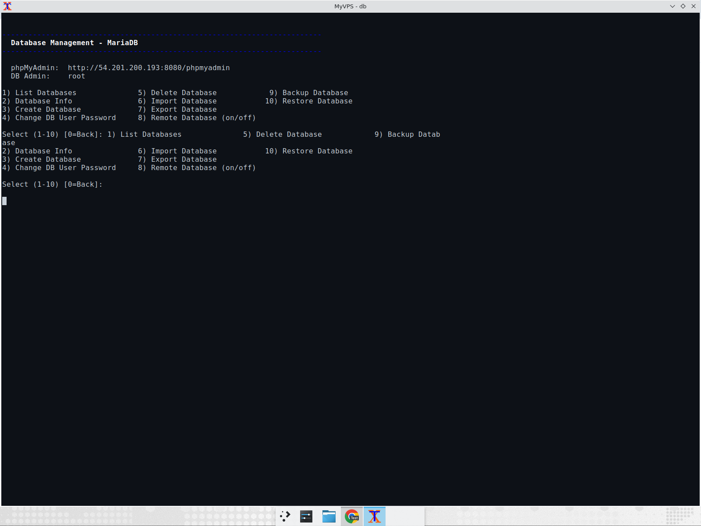

```bash
myvps db                    # Menu quản lý database
myvps db create             # Tạo database
myvps db list               # Liệt kê database
myvps db delete             # Xóa database
```

| # | Chức năng | Mô tả |
|---|-----------|-------|
| 1 | List Databases | Liệt kê tất cả DB |
| 2 | Database Info | Thông tin DB (size, tables) |
| 3 | Create Database | Tạo DB + user |
| 4 | Change DB User Password | Đổi mật khẩu DB user |
| 5 | Delete Database | Xóa DB + user |
| 6 | Import Database | Import file .sql/.sql.gz |
| 7 | Export Database | Export ra file .sql.gz |
| 8 | Remote Database | Bật/tắt truy cập từ xa |
| 9 | Backup Database | Backup DB |
| 10 | Restore Database | Restore từ backup |

---

## Module 3: PHP Management

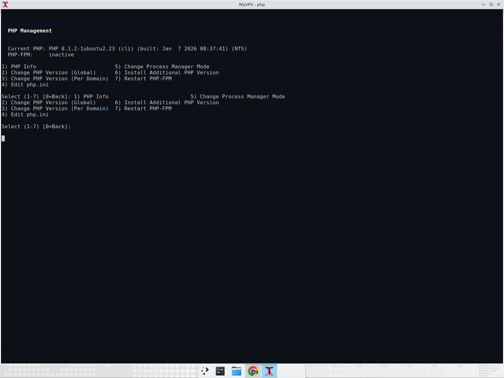

```bash
myvps php                   # Menu quản lý PHP
```

| # | Chức năng | Mô tả |
|---|-----------|-------|
| 1 | PHP Info | Xem version, modules |
| 2 | Change PHP Version (Global) | Đổi version toàn server |
| 3 | Change PHP Version (Per Domain) | Đổi version cho 1 domain |
| 4 | Edit php.ini | Sửa cấu hình PHP |
| 5 | Change Process Manager Mode | Static/Dynamic/OnDemand |
| 6 | Install Additional PHP Version | Cài thêm PHP version |
| 7 | Restart PHP-FPM | Khởi động lại PHP |

---

## Module 4: Nginx Management

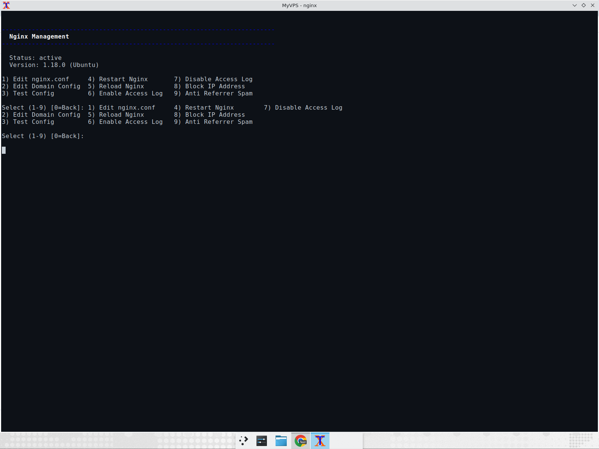

```bash
myvps nginx                 # Menu quản lý Nginx
```

| # | Chức năng | Mô tả |
|---|-----------|-------|
| 1 | Edit nginx.conf | Sửa config chính |
| 2 | Edit Domain Config | Sửa config từng domain |
| 3 | Test Config | Test cấu hình (nginx -t) |
| 4 | Restart Nginx | Khởi động lại |
| 5 | Reload Nginx | Reload config |
| 6 | Enable Access Log | Bật access log |
| 7 | Disable Access Log | Tắt access log |
| 8 | Block IP Address | Chặn IP |
| 9 | Anti Referrer Spam | Chống spam referrer |

---

## Module 5: SSL Management

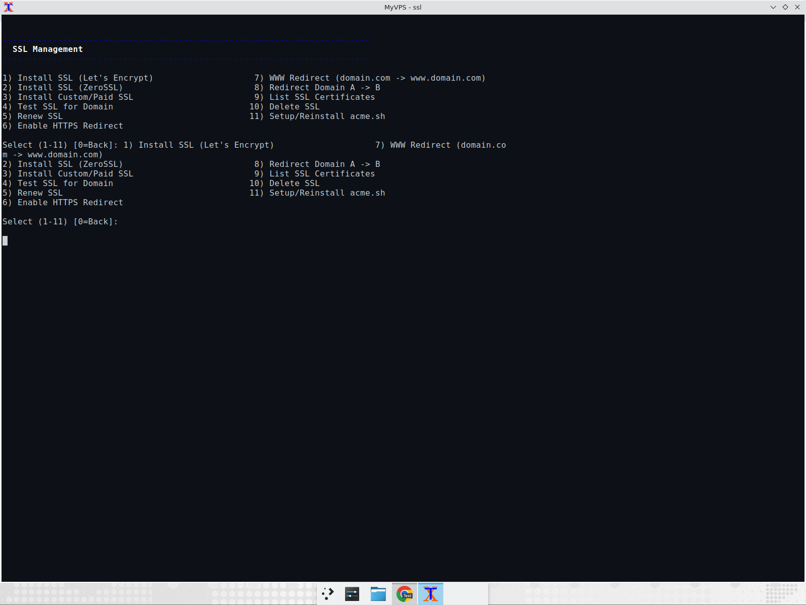

```bash
myvps ssl                   # Menu quản lý SSL
myvps ssl install           # Cài SSL
```

| # | Chức năng | Mô tả |
|---|-----------|-------|
| 1 | Install SSL (Let's Encrypt) | SSL miễn phí qua Let's Encrypt |
| 2 | Install SSL (ZeroSSL) | SSL miễn phí qua ZeroSSL |
| 3 | Install Custom/Paid SSL | Cài SSL mua (cert + key) |
| 4 | Test SSL | Kiểm tra SSL domain |
| 5 | Renew SSL | Gia hạn SSL |
| 6 | Enable HTTPS Redirect | Chuyển hướng HTTP → HTTPS |
| 7 | WWW Redirect | domain.com → www.domain.com |
| 8 | Redirect Domain A → B | Chuyển hướng domain |
| 9 | List SSL Certificates | Liệt kê SSL |
| 10 | Delete SSL | Xóa SSL |
| 11 | Setup/Reinstall acme.sh | Cài lại acme.sh |

---

## Module 6: SSH/SFTP Management

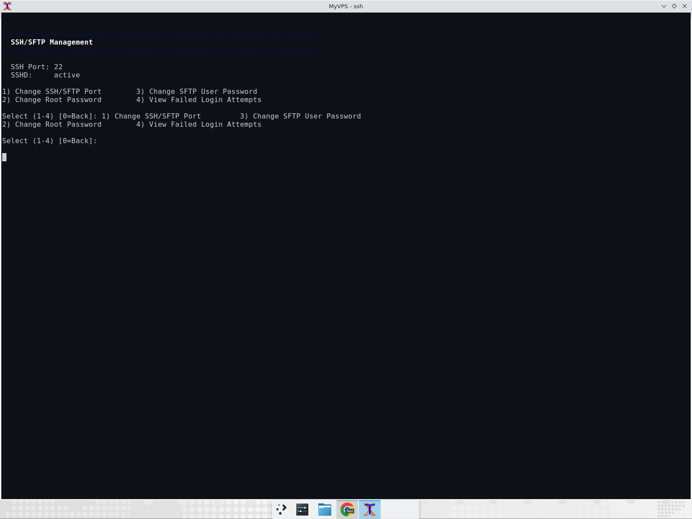

```bash
myvps ssh                   # Menu quản lý SSH
```

| # | Chức năng | Mô tả |
|---|-----------|-------|
| 1 | Change SSH/SFTP Port | Đổi port SSH |
| 2 | Change Root Password | Đổi mật khẩu root |
| 3 | Change SFTP User Password | Đổi mật khẩu SFTP user |
| 4 | View Failed Login Attempts | Xem lần đăng nhập thất bại |

---

## Module 7: Firewall Management

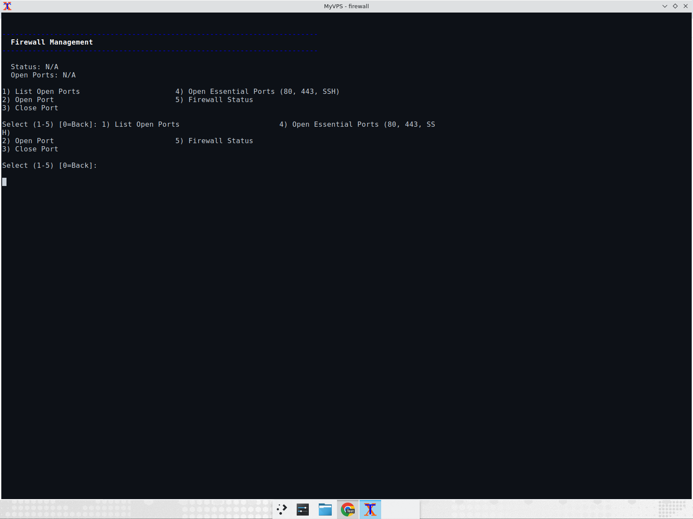

```bash
myvps firewall              # Menu quản lý firewall
```

| # | Chức năng | Mô tả |
|---|-----------|-------|
| 1 | List Open Ports | Liệt kê port đang mở |
| 2 | Open Port | Mở port |
| 3 | Close Port | Đóng port |
| 4 | Open Essential Ports | Mở ports 80, 443, SSH |
| 5 | Firewall Status | Trạng thái firewall |

---

## Module 8: Cache Management

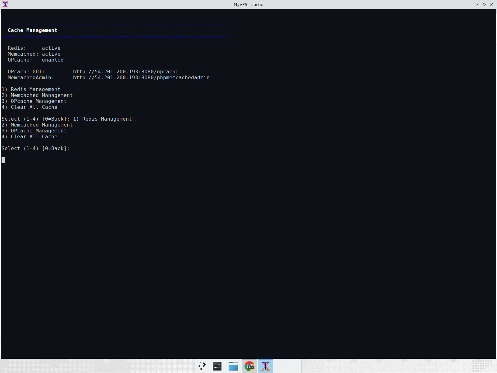

```bash
myvps cache                 # Menu quản lý cache
```

| # | Chức năng | Mô tả |
|---|-----------|-------|
| 1 | Redis Management | Start/Stop/Restart Redis |
| 2 | Memcached Management | Start/Stop/Restart Memcached |
| 3 | OPcache Management | Reset OPcache |
| 4 | Clear All Cache | Xóa tất cả cache |

---

## Module 9: Swap Management

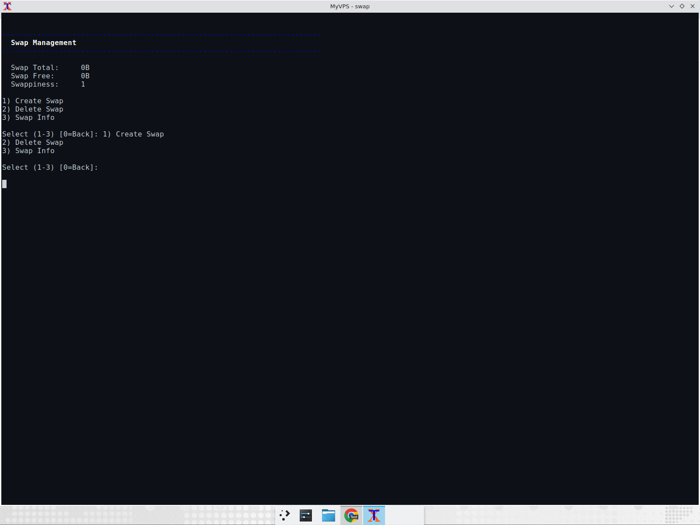

```bash
myvps swap                  # Menu quản lý Swap
```

| # | Chức năng | Mô tả |
|---|-----------|-------|
| 1 | Create Swap | Tạo swap file |
| 2 | Delete Swap | Xóa swap |
| 3 | Swap Info | Thông tin swap |

---

## Module 10: Backup & Restore

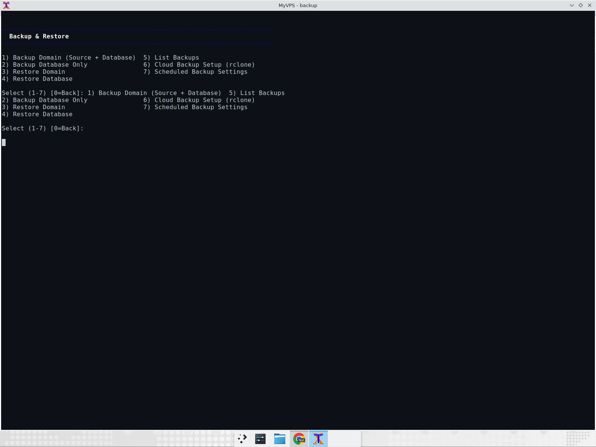

```bash
myvps backup                # Menu backup/restore
```

| # | Chức năng | Mô tả |
|---|-----------|-------|
| 1 | Backup Domain | Backup source + database |
| 2 | Backup Database Only | Chỉ backup database |
| 3 | Restore Domain | Restore từ backup |
| 4 | Restore Database | Restore database |
| 5 | List Backups | Liệt kê file backup |
| 6 | Cloud Backup Setup | Cấu hình rclone |
| 7 | Scheduled Backup | Cấu hình backup tự động |

---

## Module 11: WordPress Management

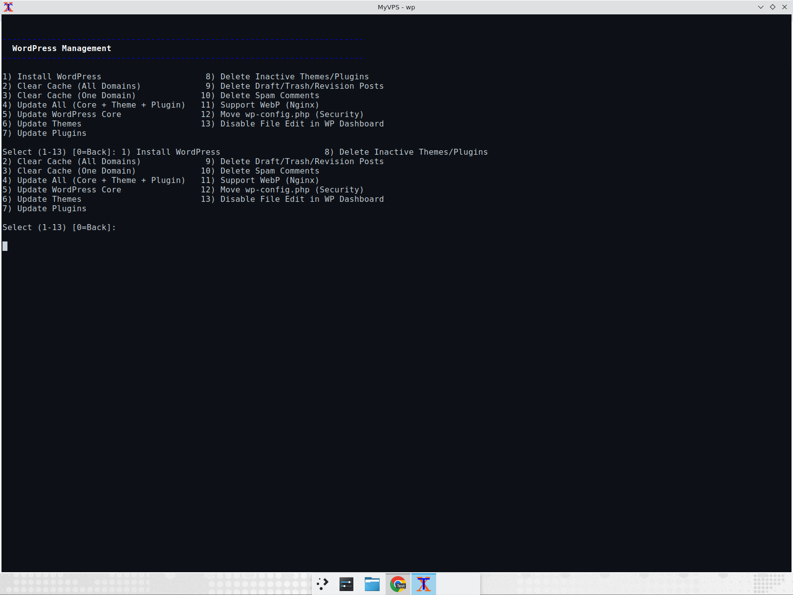

```bash
myvps wp                    # Menu WordPress
myvps wp install            # Cài WordPress
```

| # | Chức năng | Mô tả |
|---|-----------|-------|
| 1 | Install WordPress | Cài WP cho domain |
| 2 | Clear Cache (All) | Xóa cache tất cả domain |
| 3 | Clear Cache (One) | Xóa cache 1 domain |
| 4 | Update All | Cập nhật core + theme + plugin |
| 5 | Update Core | Cập nhật WordPress core |
| 6 | Update Themes | Cập nhật themes |
| 7 | Update Plugins | Cập nhật plugins |
| 8 | Delete Inactive Themes/Plugins | Xóa theme/plugin không dùng |
| 9 | Delete Draft/Trash/Revision | Xóa bài nháp/rác |
| 10 | Delete Spam Comments | Xóa comment spam |
| 11 | Support WebP | Bật WebP cho Nginx |
| 12 | Move wp-config.php | Di chuyển wp-config (bảo mật) |
| 13 | Disable File Edit | Tắt sửa file trong WP admin |

---

## Module 12: Laravel Management

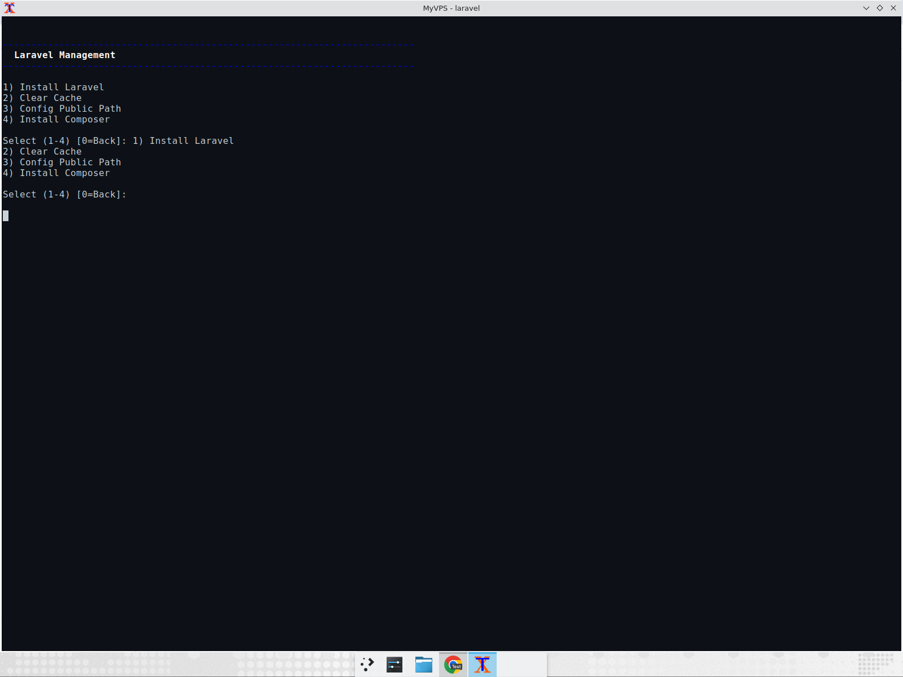

```bash
myvps laravel               # Menu Laravel
```

| # | Chức năng | Mô tả |
|---|-----------|-------|
| 1 | Install Laravel | Cài Laravel cho domain |
| 2 | Clear Cache | Xóa cache Laravel |
| 3 | Config Public Path | Cấu hình public directory |
| 4 | Install Composer | Cài Composer |

---

## Module 13: System Monitor


```bash
myvps monitor               # Xem system status
myvps status                # Alias cho monitor
```

Hiển thị: Date, IP, Load Average, CPU, RAM, Swap, Disk, Services status, Version.

---

## Module 14: Log Management


```bash
myvps log                   # Menu quản lý log
```

| # | Chức năng | Mô tả |
|---|-----------|-------|
| 1 | Nginx Error Log | Xem nginx error log |
| 2 | PHP-FPM Log | Xem PHP-FPM log |
| 3 | MariaDB Log | Xem MariaDB log |
| 4 | Domain Log | Xem log theo domain |
| 5 | Clear All Logs | Xóa tất cả log |

---

## Module 15: Port Management


```bash
myvps port                  # Menu quản lý port (= firewall)
```

---

## Module 16: Fail2Ban Management

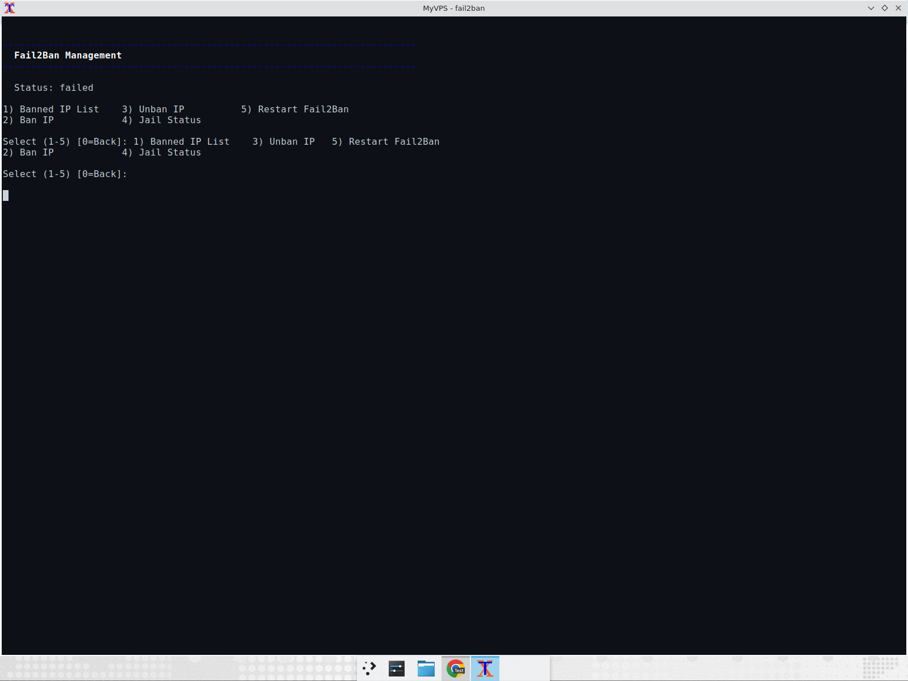

```bash
myvps fail2ban              # Menu Fail2Ban
```

| # | Chức năng | Mô tả |
|---|-----------|-------|
| 1 | Banned IP List | Liệt kê IP bị ban |
| 2 | Ban IP | Ban 1 IP |
| 3 | Unban IP | Gỡ ban IP |
| 4 | Jail Status | Trạng thái jail |
| 5 | Restart Fail2Ban | Khởi động lại |

---

## Module 17: Admin Panel

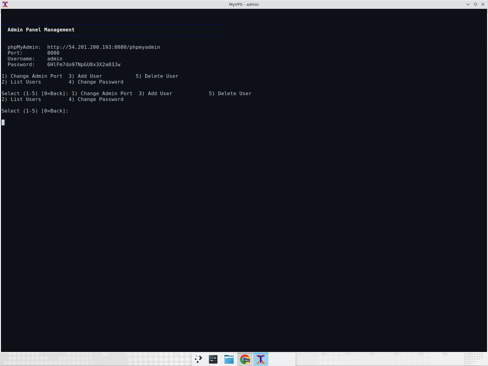

```bash
myvps admin                 # Menu Admin Panel
```

| # | Chức năng | Mô tả |
|---|-----------|-------|
| 1 | Change Admin Port | Đổi port phpMyAdmin |
| 2 | List Users | Liệt kê admin users |
| 3 | Add User | Thêm admin user |
| 4 | Change Password | Đổi mật khẩu admin |
| 5 | Delete User | Xóa admin user |

---

## Module 18: Crontab Management

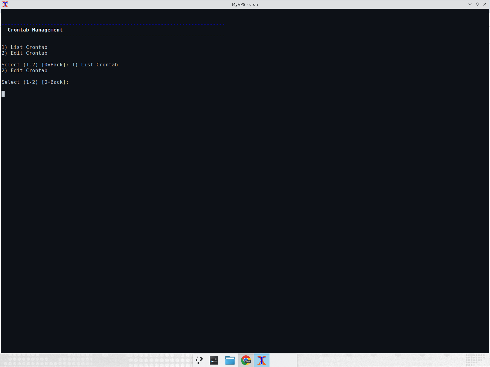

```bash
myvps cron                  # Menu Crontab
```

| # | Chức năng | Mô tả |
|---|-----------|-------|
| 1 | List Crontab | Liệt kê cron jobs |
| 2 | Edit Crontab | Mở editor sửa crontab |

---

## Module 19: Utility Tools

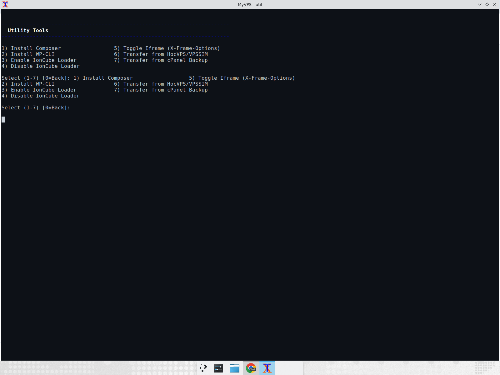

```bash
myvps util                  # Menu Utility
```

| # | Chức năng | Mô tả |
|---|-----------|-------|
| 1 | Install Composer | Cài Composer |
| 2 | Install WP-CLI | Cài WP-CLI |
| 3 | Enable IonCube Loader | Bật IonCube |
| 4 | Disable IonCube Loader | Tắt IonCube |
| 5 | Toggle Iframe | Bật/tắt X-Frame-Options |
| 6 | Transfer from HocVPS/VPSSIM | Di chuyển từ HocVPS/VPSSIM |
| 7 | Transfer from cPanel Backup | Di chuyển từ cPanel |

---

## Module 20: System Status

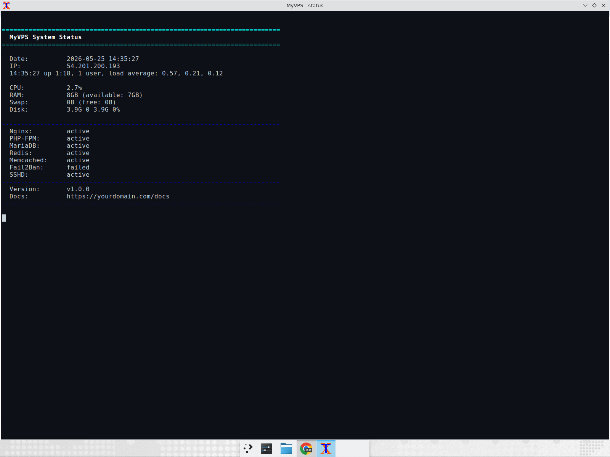

```bash
myvps status                # Xem trạng thái hệ thống
myvps --json status         # Output JSON (cho API/Web UI)
```

---

## JSON Output Mode

Tất cả module hỗ trợ output JSON bằng flag `--json`:

```bash
myvps --json status         # System status dạng JSON
myvps --json domain list    # Domain list dạng JSON
```

JSON output được Agent sử dụng để cung cấp dữ liệu cho Dashboard.
